옛날 옛적에 만들었던 핸즈온 자료 올려봅니다 ㅎㅎㅎ
당시 나름 공들여서 만들었던것 같은데,,, 지금 보니 내용이 안맞는 부분이 쫌 있네요
# Basic Hands-On 


---

# **Overview**

본 Hands-on에서는 AWS에서 여러 서버를 구성하여 웹페이지를 서비스하기 위한 기반 인프라 구축 방법에 대하여 설명합니다.

## **Architecture diagram**


## Summary for technical requirements

[Untitled](assets/images/basichandson/Untitled%20Database%2099593cb124864fec99e17371b412264e.md)

##

# 1. VPC(Virtual Private Cloud) 환경 구성하기

## 1.1 VPC(Virtual Private Cloud)란?

Amazon Virtual Private Cloud(VPC)를 사용하면 AWS 클라우드에서 **논리적으로 격리된 공간**을 프로비저닝하여 고객이 정의하는 가상 네트워크에서 AWS 리소스를 시작할 수 있습니다.

또한, IP 주소 범위 선택, 서브넷 생성, 라우팅 테이블 및 네트워크 게이트웨이 구성 등 가상 네트워킹 환경을 완벽하게 제어할 수 있습니다. VPC에서 IPv4와 IPv6를 모두 사용하여 리소스와 애플리케이션에 안전하고 쉽게 액세스할 수 있습니다.

**VPC 구성 요소**

- **Virtual Private Cloud(VPC)** - 사용자의 AWS 계정 전용 가상 네트워크입니다.
- **서브넷** - VPC의 IP 주소 범위입니다.
- **라우팅 테이블** - 네트워크 트래픽을 전달할 위치를 결정하는 데 사용하는 라우팅이라는 이름의 규칙 집합입니다.
- **인터넷 게이트웨이** - VPC의 리소스와 인터넷 간의 통신을 활성화하기 위해 VPC에 연결하는 게이트웨이입니다.
- **VPC 엔드포인트** - 인터넷 게이트웨이, NAT 디바이스, VPN 연결 또는 AWS Direct Connect 연결 없이도 PrivateLink로 구동하는 지원되는 AWS 서비스 및 VPC 엔드포인트 서비스에 비공개로 연결할 수 있게 합니다. VPC의 인스턴스는 서비스의 리소스와 통신하는 데 퍼블릭 IP 주소를 필요로 하지 않습니다. VPC와 기타 서비스 간의 트래픽은 Amazon 네트워크를 벗어나지 않습니다.
- **CIDR 블록** - 클래스 없는 도메인 간 라우팅입니다. 인터넷 프로토콜 주소 할당 및 라우팅 집계 방법입니다.

### 1.1.1 VPC

Virtual Private Cloud(VPC)는 사용자의 AWS 계정 전용 가상 네트워크입니다. VPC는 AWS 클라우드에서 다른 가상 네트워크와 논리적으로 분리되어 있습니다.

클라우드에서 생성하는 자원들은 기본적으로 특정 네트워크 위에서 생성되며 이에 접근하기 위한 프라이빗 IP를 가집니다. 이 리소스들은 특정한 VPC 위에서 만들어지며 CIDR 범위 안에서 적절한 IP를 할당 받게 됩니다.  `192.168.0.0/24` CIDR 블록을 가진 VPC에서 생성한 EC2 인스턴스는  `192.168.0.127`이라는 IP를 할당 받을 수 있습니다. VPC의 범위 내에서 할당 가능한 IP가 모두 할당되면 더 이상 리소스를 만들 수 없기 때문에 적절한 크기의 VPC를 만들어야 합니다.

- 참고) CIDR
  - VPC 생성 시 인터넷 연결이 필요한 경우 반드시 사설망 대역을 사용해야 하며, 인터넷 연결이 필요하지 않더라도 가능하면 사설망 대역을 사용하는 것을 권장합니다.
    `52.12.0.0/16`을 CIDR 블록으로 지정한 경우 해당 VPC 에서  `52.12.0.0/16`로 접속하는 트래픽은 VPC 내부로 라우트 됩니다. 이 범위의 IP는 인터넷에서 사용할 수 있는 IP여서 해당 VPC에서는 `52.12.0.0/16`에 속한 인터넷 IP에 접근하는 것이 원천적으로 불가능합니다.
    그렇기 때문에 `10.0.0.0/8`,  `172.16.0.0/12`,  `192.168.0.0/16`와 같은 사설망 대역을 사용해야합니다.
  - 10.0.0.0/24 일경우, IP 대역은 10.0.0.0 ~ 10.0.0.255 까지 256 개의 IP 가 사용 가능합니다.
    하지만, AWS 에서 기본적으로 서비스를 위해 IP 앞대역 부분에서 4 개, 뒤쪽 대역에서 1 개를 미리 사용하기 때문에, 실제로 이용가능한 대역은 10.0.0.4~10.0.0.254 이고, 251 개의 IP 를 사용 가능합니다.
  - 만약 하나의 서브넷 마다 좀 더 많은 IP 대역을 가지고 싶은 경우
    10.0.0.0/20 = 10.0.0.0 ~ 10.0.15.255 = 4096 개 IP,
    10.0.16.0/20 = 10.0.16.0 ~ 10.0.31.255 = 4096 개 IP 와 같이 이용 가능합니다.
  - AWS 에서 사용할 수 있는 가장 큰 대역은 10.0.0.0/16, 가장 작은 대역은 10.0.0.0/28 입니다.
  - CIDR 에 대해서 계산하기 힘들 경우, 아래와 같은 CIDR Calculator 를 이용하시면 편리합니다.

    CIDR Calculator : [https://www.ipaddressguide.com/cidr](https://www.ipaddressguide.com/cidr)

### 1.1.2 서브넷(Subnet)

서브넷은 VPC 안에서 실제로 리소스가 생성될 수 있는 네트워크입니다.

하나의 VPC는 N개의 서브넷을 가질 수 있습니다. VPC와 동일한 크기의 서브넷을 하나만 만드는 것도 가능하며, 일반적으로 사용할 수 있는 가용존을 고려해서 적절한 크기의 서브넷들을 가용존 수만큼 생성해서 사용합니다. N개의 가용존 만큼 서브넷을 만들어 리소스를 분산하면 재해 대응 측면에서도 유리합니다.

서브넷의 넷마스크 범위는 Prefix /16(65535개)에서 /28(16개)을 사용할 수 있으며, VPC CIDR 블럭 범위에 안에 속하는 CIDR 블럭을 지정할 수 있습니다.

하나의 서브넷은 하나의 가용존과 연결 됩니다. 재해 대응을 위해 2개 이상의 가용존을 사용하는 게 일반적이며 그 안에 적절한 수의 서브넷을 생성하여 활용하면 됩니다.

### 1.1.3 라우트 테이블(Route Table)

라우트 테이블은 서브넷과 연결되어있는 리소스입니다. 서브넷에서 네트워크를 이용할 때는 이 라우트 테이블을 사용해서 목적지를 찾게 됩니다. 라우트 테이블은 서브넷과 연결되어있지만 VPC를 생성할 때 만들어지고 VPC에도 연결되어 있습니다. 이 라우트 테이블은 VPC에 속한 서브넷을 만들 때 기본 라우트 테이블로 사용됩니다.

### 1.1.4 인터넷 게이트웨이(Internet Gateway)

VPC는 기본적으로 격리되 네트워크 환경입니다. 따라서 VPC에서 생성된 리소스들은 기본적으로 인터넷을 사용할 수가 없습니다. 인터넷에 연결하기 위해서는 인터넷 게이트웨이가 필요합니다. 라우팅 테이블에 인터넷 게이트웨이를 향하는 적절한 규칙을 추가해주면 특정 서브넷이 인터넷과 연결됩니다. 하지만 서브넷과 인터넷 게이트웨이를 연결하는 것만으로는 인터넷을 사용할 수 없습니다. 인터넷을 사용하고자 하는 리소스는 퍼블릭 IP를 가지고 있어야합니다.

### 1.1.5 DHCP 옵션셋(DHCP options set)

DHCP 옵션셋은 TCP/IP 네트워크 상의 호스트로 설정 정보를 전달하는 DHCP 표준입니다. 이 기능을 사용하면 도메인 네임 서버, 도메인 네임, NTP 서버, NetBIOS 서버 등의 정보를 설정할 수 있습니다. 일반적으로 VPC 생성 시 만들어지는 DHCP 옵션셋을 그대로 사용합니다.

### 1.1.6 네트워크 ACL(Network ACL) / 시큐리티 그룹(Security Group)

네트워크 ACL은 주고(outbound) 받는(inbound) 트래픽을 제어하는 가상 방화벽입니다. 하나의 네트워크 ACL은 다수의 서브넷에서 재사용할 수 있습니다.

시큐리티 그룹은 인스턴스의 앞단에서 트래픽을 제어하는 가상 방화벽인 반면, 네트워크 ACL은 서브넷 앞단에서 트래픽을 제어하는 역할을 합니다. 따라서 네트워크 ACL의 규칙을 통과하더라도 시큐리티 그룹의 규칙을 통과하지 못 하면 인스턴스와는 통신하지 못 할 수 있습니다. 이 두 가지 리소스를 통해서 안전한 네트워크 환경을 구축할 수 있습니다.

- 출처: [https://www.44bits.io/ko/post/understanding_aws_vpc](https://www.44bits.io/ko/post/understanding_aws_vpc)

## 1.2 VPC(Virtual Private Cloud) 생성하기

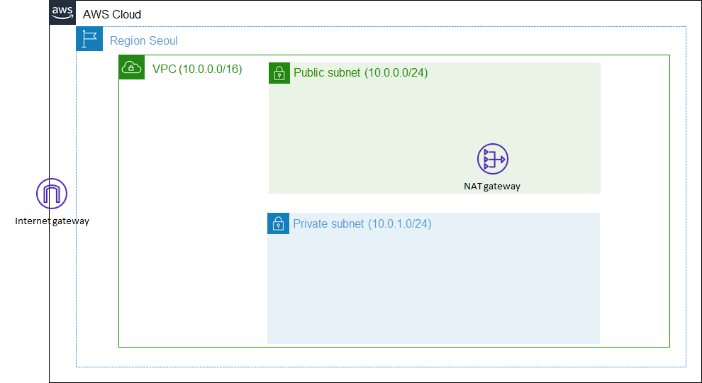

- IP 주소 범위 선택 하기
- 가용 영역(AZ)별 서브넷 설정
- 인터넷으로 향하는 경로 설정하기(Route)
- VP로 부터의 트래픽 설정하기

### 1.2.1 IP 주소 범위 선택 하기

본 실습의 전 과정은 Seoul region에서 모든 작업을 수행 합니다.
Console 화면에서 Region 을 “Asia Pacific (Seoul)”을 선택 합니다.


> “Service” -> VPC 를 선택합니다.

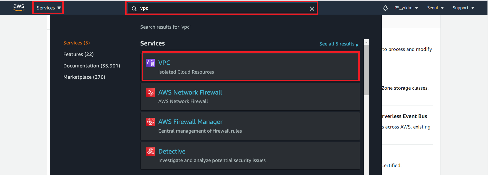

> “Your VPCs” -> “Create VPC”

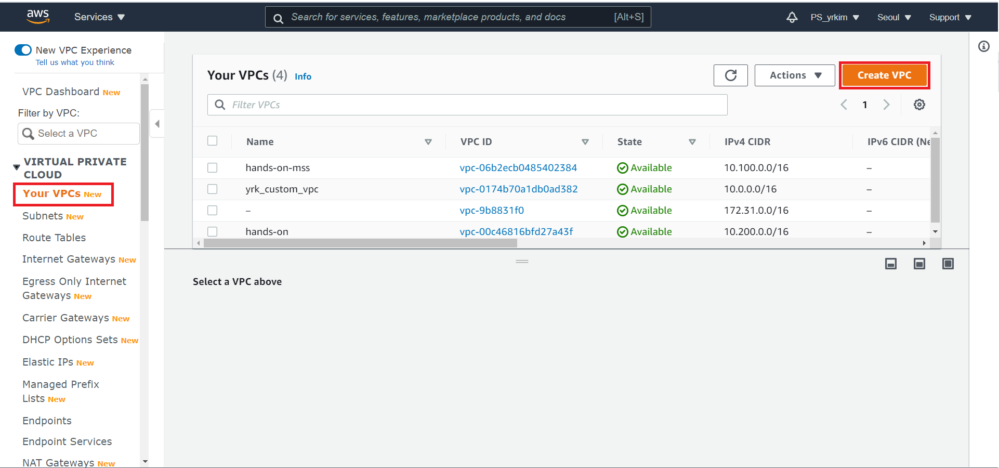

IDC에 비유하면 네트워크의 전반적인 골격을 우리는 VPC라는 형태로 생성할 수 있습니다.

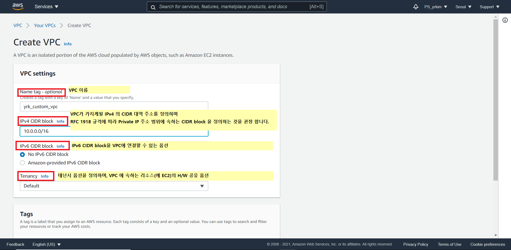

- Name tag : VPC의 이름(megazone-hands-on)
- IPv4 CIDR block : VPC가 가지게될 IPv4 의 CIDR 대역 주소를 정의하며 RFC 1918 규격에 따라 Private IP 주소 범위에 속하는 CIDR block 을 정의하는 것을 권장 합니다.
- IPv6 CIDR block : IPv6 CIDR block 을 VPC에 연결할 수 있는 옵션
- Tenancy : 테넌시 옵션을 정의하며, VPC 에 속하는 리소스(예 EC2)의 H/W 공유 옵션

기본적으로 VPC 를 생성하게 되면, Default Route table, Network ACL, DHCP options set 등이 자동으로 생성 됩니다.

“DNS hostname” 옵션을 enable 함으로써, VPC 내 속한 리소스(예, Ec2 인스턴스)들이 DNS Name을 가지도록 설정 합니다.

> VPC 선택 → Edit DNS hostname 클릭 → DNS hostname 'Enable' 체크박스 선택

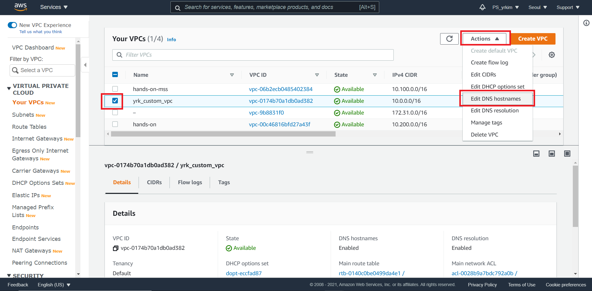

- DNS hostnames 는 VPC에서 AWS 리소스가 시작하는 경우 Public DNS 혹은 Private DNS 를 제공하는 옵션이며, 일반적인 운영 환경에서 enable 하신 후 사용 합니다.

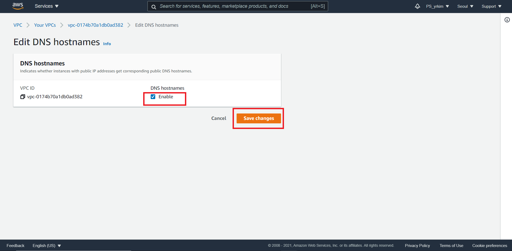

여기까지 수행 하셨다면, VPC 생성이 완료된 것 입니다 😀

### 1.2.2 서브넷 생성하기

VPC 생성으로 저희는 AWS 내의 가상의 네트워크를 만들었습니다.

이제부터 VPC 내에서 가용 영역(Available Zone)에 따라 Subnet 을 생성해 주도록 하겠습니다.

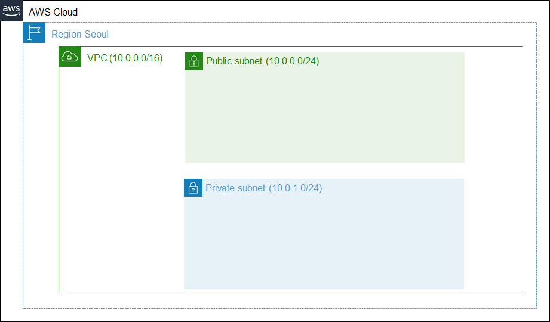

> “Subnets” -> “Create subnet”

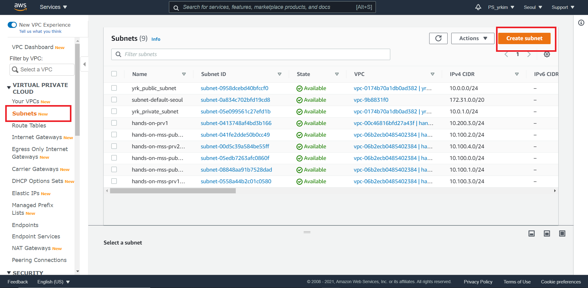

서브넷은 VPC의 IP 주소 범위 이며, 가용 영역(Availability Zone)에 종속 됩니다.
아래와 같이 서브넷을 생성합니다.

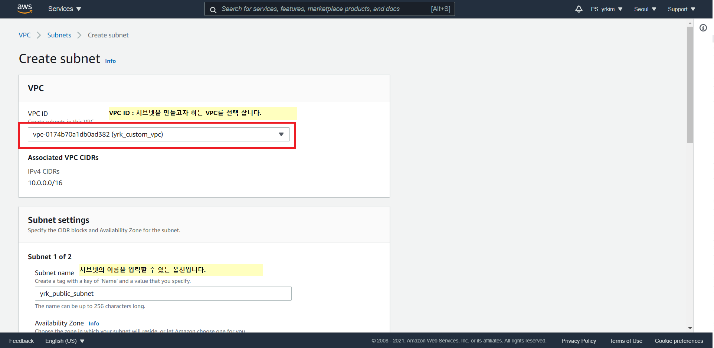

- VPC ID : 서브넷을 만들고자 하는 VPC를 선택 합니다.
- Subnet name : 서브넷의 이름을 입력할 수 있는 옵션입니다.
- Availability Zone : 서브넷이 상주하게 될 가용영역을 선택합니다. “No Preference” 는 AWS가 가용영역을 자동으로 선택하도록 합니다.
- IPv4 CIDR block : 서브넷의 IPv4 CIDR 블록을 지정합니다.
- IPv6 CIDR block : 만약 VPC 생성 시 IPv6를 선택하셨다면 생기는 옵션 입니다.

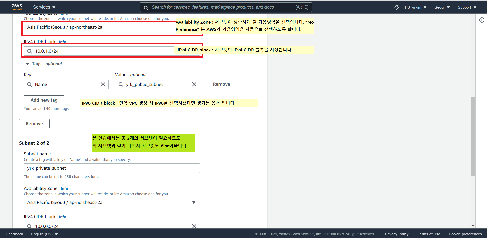

AWS 환경에서 서브넷을 생성하였습니다.

이제 아래와 같이 나머지 서브넷들도 만들어 줍니다.

[Subnet](assets/images/basichandson/Subnet%20bd12961a73dc44bd8fe4b5335067ca1a.md)

subnet을 모두 2개 생성하였고, 용도에 맞게 적절하게 name과 IP 대역을 부여 하였습니다.

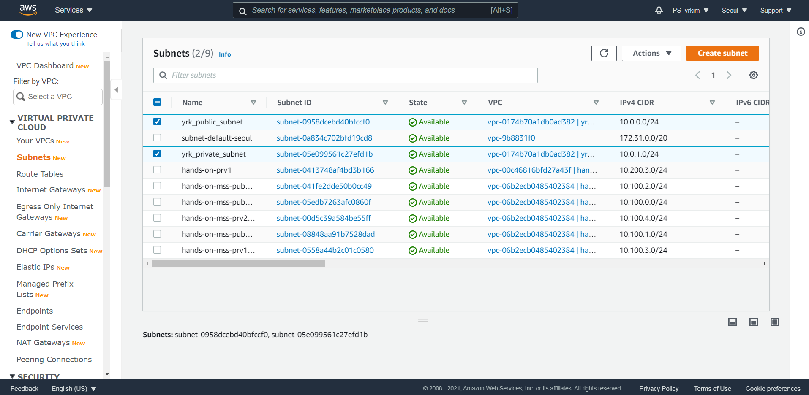

### 1.2.3 인터넷 게이트웨이 생성하기

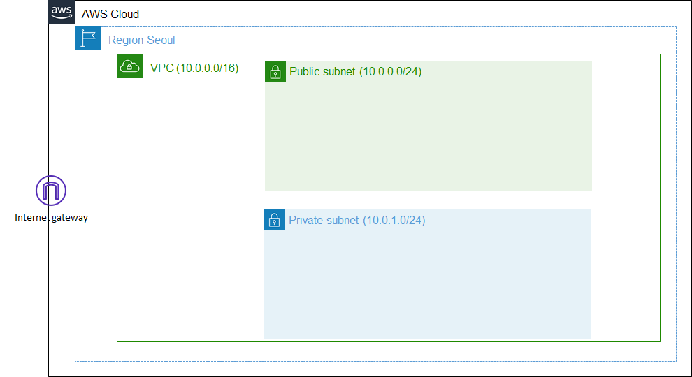

외부 엑세스를 위해 Internet gateway를 생성하겠습니다.

> “Internet Gateways” -> “Create internet gateway”

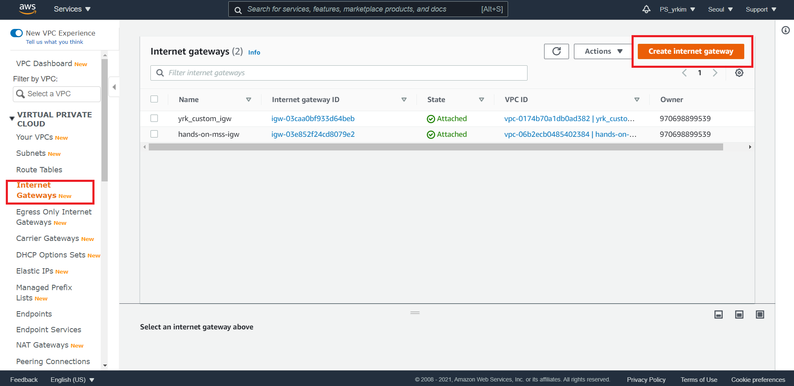

아래와 같이 생성을 위한 창을 출력 됩니다.

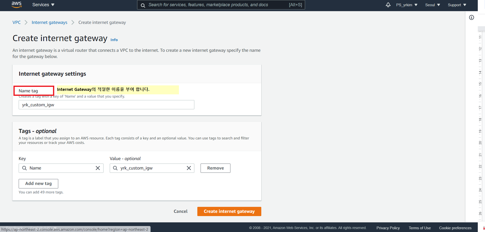

- Name tag : Internet Gateway의 적절한 이름을 부여 합니다.

인터넷 게이트웨이가 생성되게 되면, 최초 아무 VPC도 연결되지 않은 상태인 “detached” 입니다.
방금 만든 VPC인 “User_hands-on”에 Attach 시키도록 합니다.

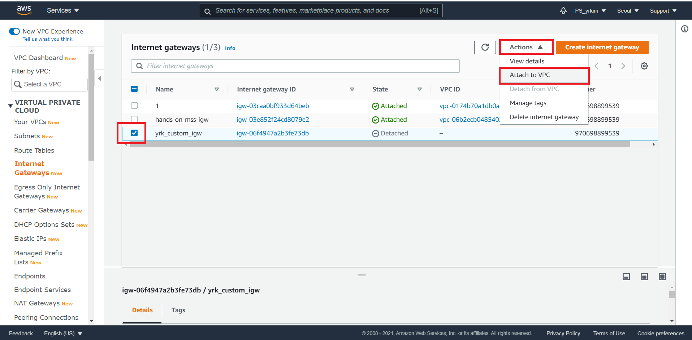

“Attach to VPC”를 선택하게 되면 VPC 선택할 수 있는 창이 출력 됩니다.

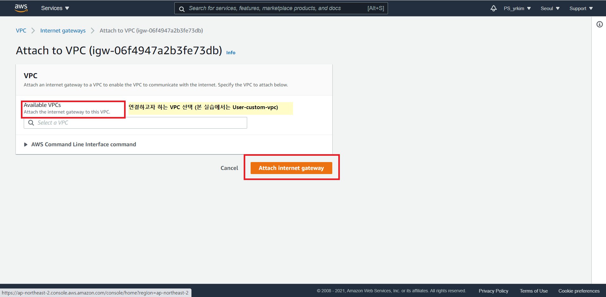

- VPC : 연결하시고자 하시는 VPC를 선택합니다. 실습간에는 “user-custom-vpc” VPC를 선택합니다.

이제 Internet Gateway\*(IGW) 를 기본 경로로 하는 Route Table 을 생성하겠습니다.

### 1.2.4 Route Table 생성하기

> “Route Tables” -> “Create route table”

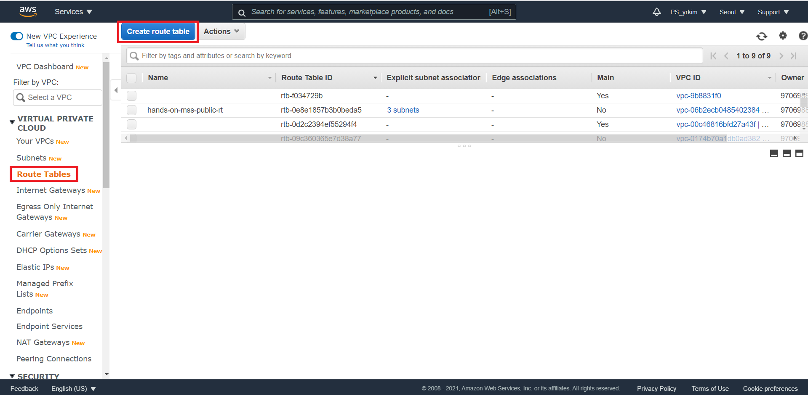

- Name tag : route table 의 적절한 이름을 정의 합니다.
- VPC : 라우팅 테이블이 속할 VPC를 정의합니다.

방금까지는 라우팅 테이블이라는 “표” 를 생성하였다고 생각하시면 됩니다.


생성된 Route table 에 모든 트래픽은 인터넷 게이트웨이로 통할 수 있는 정책을 정의하겠습니다.

> “생성된 라우트 테이블 선택“ -> “Routes” -> “Edit routes”


“Edit routes”를 클릭하시게 되면 아래와 같은 창이 출력 됩니다.

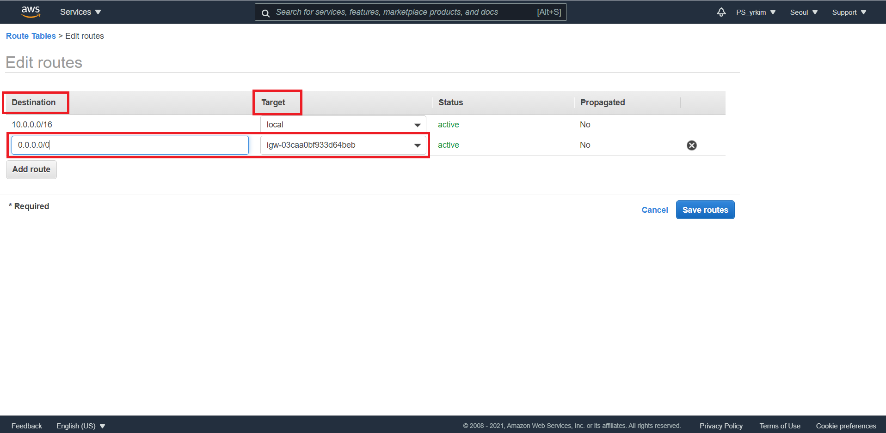

- Destination : 목적지를 입력 합니다. 참고로 0.0.0.0/0 은 모든 트래픽을 의미 합니다.
- Target : VPC가 제공하는 여러 Gateway Service를 정의합니다. 여기서는 인터넷 게이트웨이를 정의함으로써 해당 라우팅 테이블을 참조하는 서브넷은 Public zone 이 되는 것 입니다

라우팅 테이블이 생성되었으면 서브넷에 연결 하겠습니다.
실습 아키텍처에서는 10.0.0.0/24” 서브넷이 하나의 퍼블릭 라우팅 테이블을 참조하여 Public Zone으로 정의되어 있습니다.

> 라우팅 테이블 선택 -> “Subnet Associations” -> “Edit subnet associations”

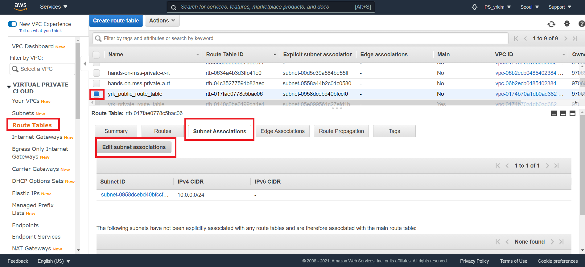

“Edit subnet associations”를 클릭하시게 되면 아래와 같은 창이 출력 됩니다.

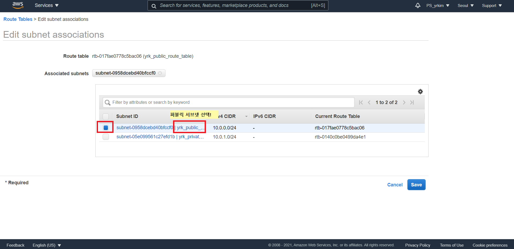

- Associated subnets : 선택한 라우팅 테이블과 연관될 서브넷을 정의 합니다.

AWS 환경에서는 이처럼 하나의 라우팅 테이블을 여러 서브넷에 할당할 수 있으며, 언제든 라우팅 테이블 자체를 변경하거나 설정을 변경할 수 있습니다.

### 1.2.4 NAT Gateway 생성하기

Private subnet 을 생성하기 이전에, Private subnet 의 외부로 가는 관문인 NAT Gateway(NAT G/W) 를 생성하겠습니다

> “NAT Gateways” -> “Create NAT Gateway” 선택.

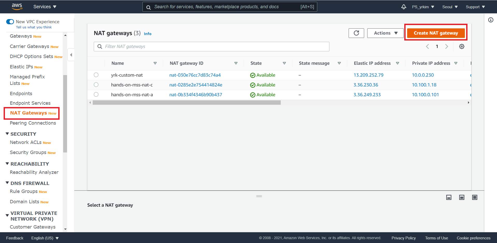

NAT Gateway를 생성하겠습니다.

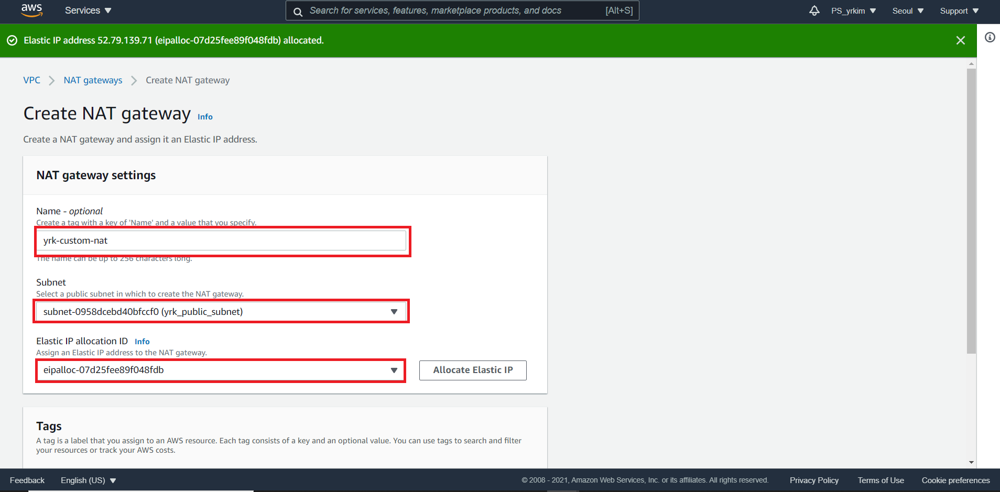

- Subnet : NAT Gateway는 반드시 Public zone에 위치한 서브넷에 존재하여야 합니다. 이전에 생성한 user_public_subnet의 Subnet ID를 명시하겠습니다.
- Elastic IP Allocation ID : 공인 IP를 선택하시거나, 새로운 공인 IP를 발급 받아 적용합니다.
  만약 Private subnet에 존재하는 인스턴스가 다른 시스템과 통신하게 될 때 통신하게 되는 시스템에서는 반드시 NAT G/W의 공인 IP를 상대측 방화벽에서 허용해주어야 합니다.

생성된 NAT G/W가 Private subnet에 라우팅 될 수 있도록 Private 전용 라우팅 테이블을 만들겠습니다.

> “Route Tables” -> “Create route table”


“Create route table”을 클릭하시게 되면 아래와 같은 창이 출력 됩니다.

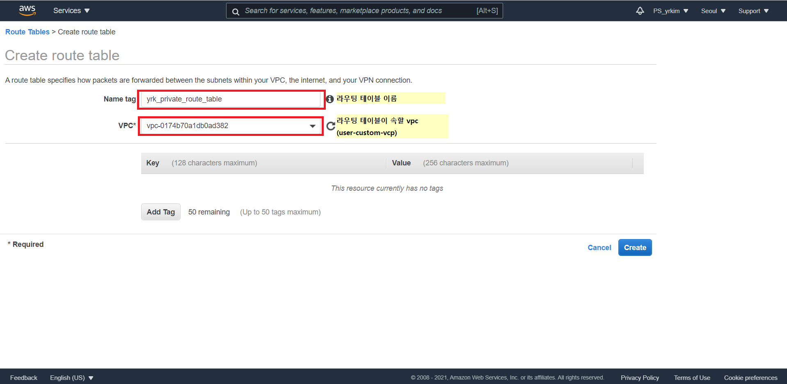

> 생성된 라우팅 테이블 선택 -> “Routes” -> “Edit routes”

“Edit Routes”를 클릭하면 아래와 같이 라우팅 테이블을 수정할 수 있습니다.

- Destination : 목적지를 입력 합니다. 참고로 여기서의 0.0.0.0/0 은 모든 트래픽을 의미 합니다.
- Target : VPC가 제공하는 여러 Gateway Service를 정의합니다. 여기서는 NAT Gateway 를 정의함으로써 해당 라우팅 테이블을 참조하는 서브넷은 Private zone 이 되는 것 입니다.

  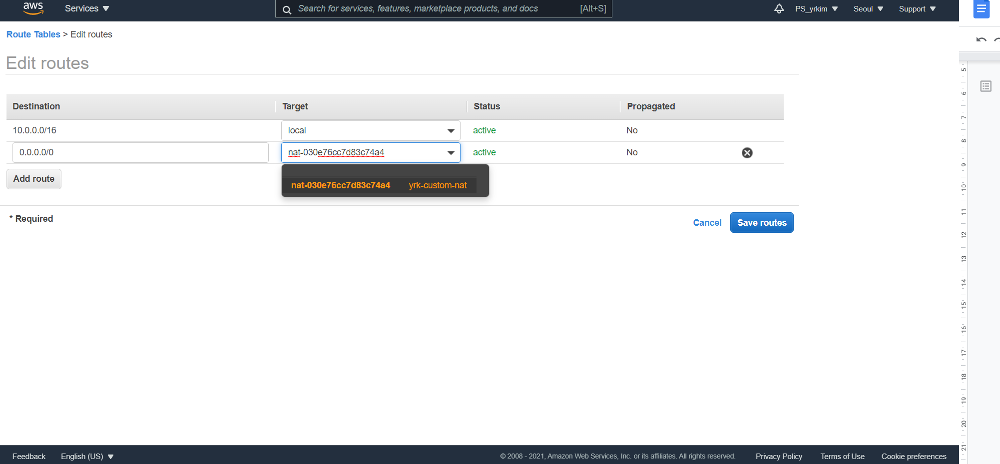

목적지가 A 가용 영역에 있는 라우팅 테이블을 A 가용 영역의 subnet 에 연결해 보겠습니다. 실습 아키텍처로는 “10.200.3.0/24” 가 A 가용 영역에 있는 서브넷 입니다.

> 라우팅 테이블 선택 -> “Subnet Associations” -> “Edit subnet associations”

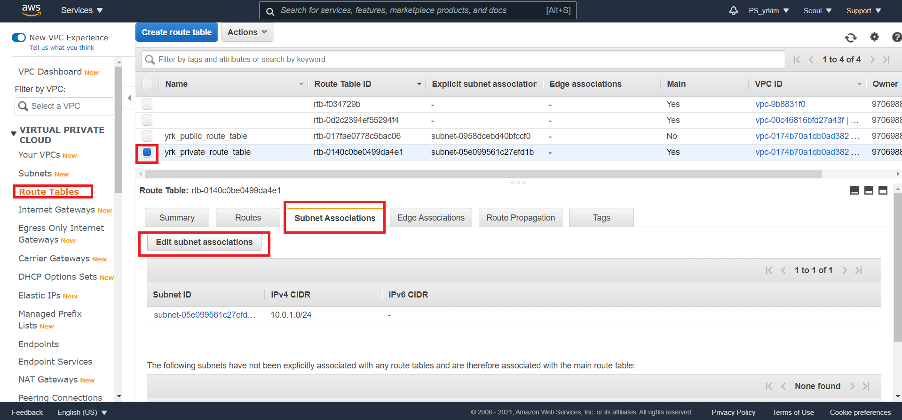

“Edit subnet associations”를 클릭하면 아래와 같이 출력 됩니다.

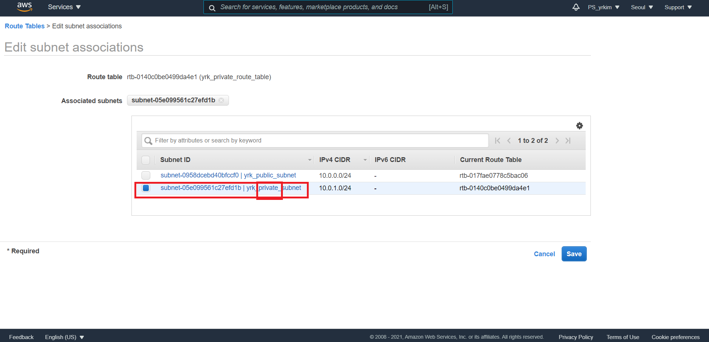

private 서브넷인 “10.0.1.0/24” 를 선택합니다.

이처럼, 앞서 설정한 Internet G/W 와 라우팅 설정하는 방법이 같습니다.
단지 목적지가 Internet G/W 이냐 NAT Gateway 이냐에 따라 Public zone 과 Private zone 이 나뉩니다.

### 1.2.5 Subnet auto-assign IP settings 설정하기

Public subnet 의 경우에는 서브넷에 생성된 리소스에 대하여 자동으로 Public IP를 할당하기 위한 설정을 합니다.

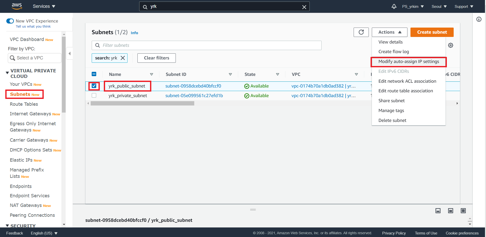

“Modify auto-assign IP settings”을 클릭하면 아래와 같은 창이 출력 됩니다.

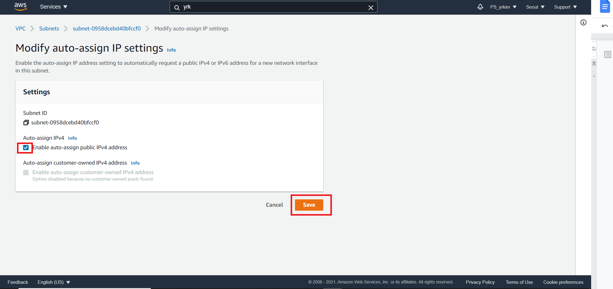

이로써 해당 서브넷에 생성되는 AWS 리소스들은 자동으로 Public IP를 가지게 됩니다. 참고로 Public IP들은 Amazon 이 가지고 있는 IPv4 pool 에서 random IP가 자동으로 할당되며, 해당 리소스가 STOP&START 혹은 재 생성되면 IP가 변경이 되는 특징이 있습니다.

---

# 2.인스턴스 구성하기

## 2.1 EC2 인스턴스란?

Amazon Elastic Compute Cloud(Amazon EC2)는 AWS 클라우드에서 확장 가능 컴퓨팅 용량을 제공합니다. Amazon EC2를 사용하면 하드웨어에 선투자할 필요가 없어 더 빠르게 애플리케이션을 개발하고 배포할 수 있습니다. Amazon EC2를 통해 원하는 만큼 가상 서버를 구축하고 보안 및 네트워크 구성과 스토리지 관리가 가능합니다. 또한 Amazon EC2는 요구 사항이나 갑작스러운 인기 증대 등 변동 사항에 따라 신속하게 규모를 확장하거나 축소할 수 있어 서버 트래픽 예측 필요성이 줄어듭니다.

<aside>
💡 자세한 내용은 [여기](https://docs.aws.amazon.com/ko_kr/AWSEC2/latest/UserGuide/concepts.html)를 참고하세요

</aside>

## 2.2 EC2 인스턴스 생성하기

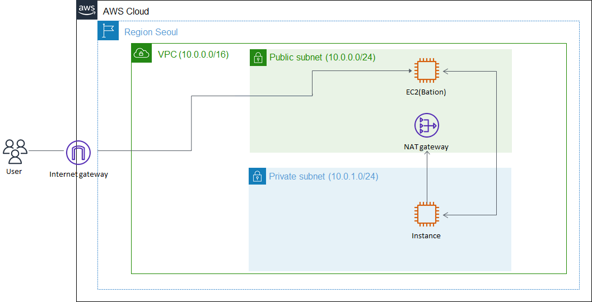

모든 실습의 EC2는 “Amazon Linux AMI” 를 기준으로 생성합니다.

### 2.2.1 Bastion 인스턴스 생성하기

우선 퍼블릭 서브넷에 위치하게 될 인스턴스를 생성하겠습니다.

> “Services” -> “EC2” 선택 OR [https://console.aws.amazon.com/ec2/](https://console.aws.amazon.com/ec2/) 클릭

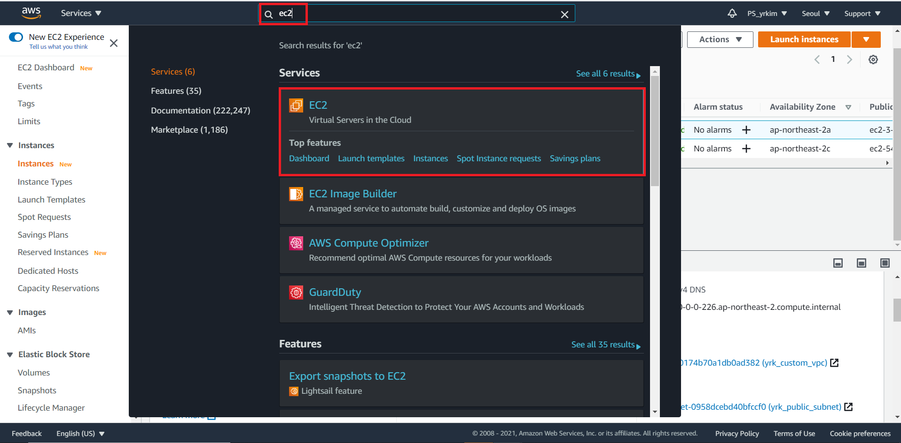

이 콘솔 페이지는 Ec2와 관련된 모든 설정을 하는 페이지 입니다.

> “Instances” -> “Launch Instance”

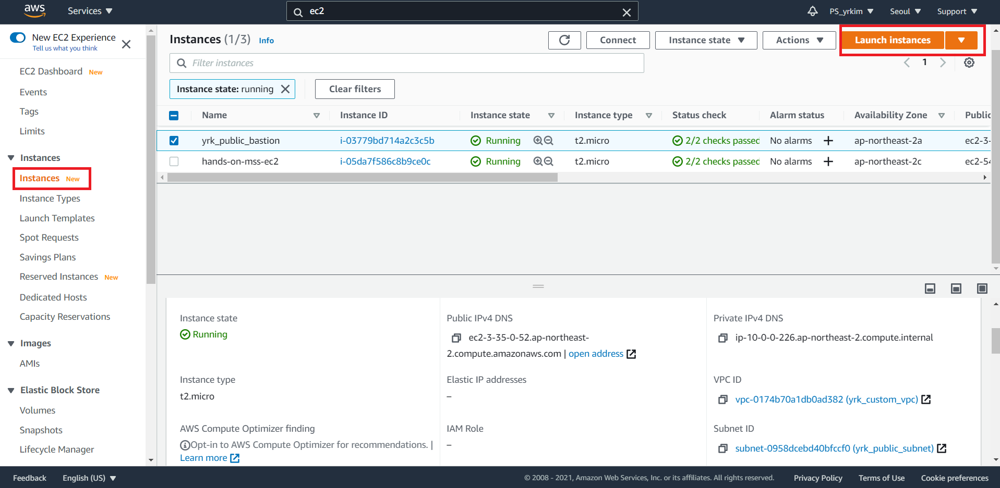

“Launch Instance”를 클릭하게 되면 아래 7가지 과정을 통하여 인스턴스를 생성할 수 있습니다.

**AMI(Amazon Machine Image)를 선택합니다.**

AMI(Amazon Machine Image) 는 클라우드의 가상 서버인 인스턴스를 시작하는 데 필요한 정보를 제공하며, 크게 4종류의 AMI 가 있습니다.

1. Quick Start : Amazon 에서 공식으로 제공하는 AMI 이며, Amazon 에 의해 최신 패치로 release 됩니다. 2. My AMIs : 나의 AWS 계정에서 생성되거나, 다른 AWS 계정에서 공유된 AMI 입니다.
2. AWS Marketplace : Amazon Partner 에서 유료 혹은 무료로 판매하는 AMI 입니다.
3. Community AMIs : 여러 커뮤니티에서 제공하는 AMI 입니다.

본 실습 과정에서는 Free tier 계정에서 무료로 이용할 수 있는 “Amazon Linux AMI” 를 이용하겠습니다.

> “Quick Start” -> Amazon Linux AMI -> “Select”

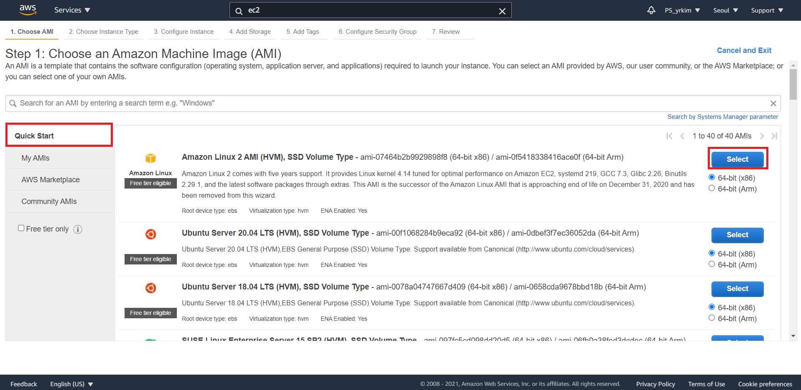

> “t2.micro” -> “Next: Configure Instance Details”

**Instance Type을 정의합니다.**

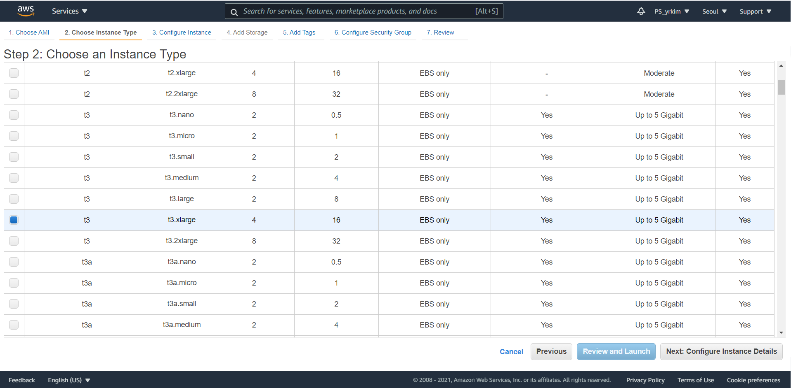

인스턴스 타입은 00000일 기준 약 00개 정도 있습니다.
사용자는 Ec2 인스턴스에서 실행될 어플리케이션의 워크로드에 따라 인스턴스 타입과 크기를 정의하여야 합니다.

**생성될 인스턴스의 세부 설정을 정의 합니다.**

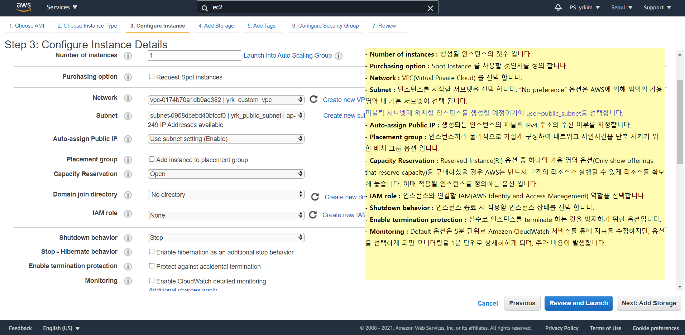

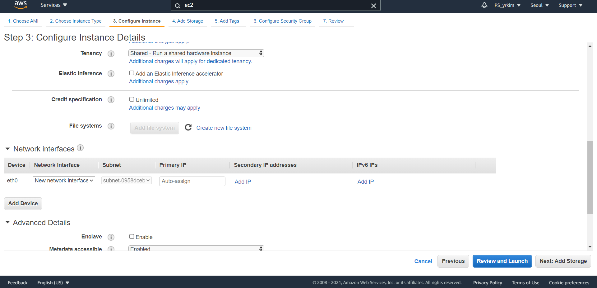

- Number of instances : 생성될 인스턴스의 갯수 입니다.
- Purchasing option : Spot Instance 를 사용할 것인지를 정의 합니다.
- Network : VPC(Virtual Private Cloud) 를 선택 합니다.
- Subnet : 인스턴스를 시작할 서브넷을 선택 합니다. “No preference” 옵션은 AWS에 의해 임의의 가용 영역 내 기본 서브넷이 선택 됩니다.
- Auto-assign Public IP : 생성되는 인스턴스의 퍼블릭 IPv4 주소의 수신 여부를 지정합니다.
- Placement group : 인스턴스끼리 물리적으로 가깝게 구성하여 네트워크 지연시간을 단축 시키기 위한 배치 그룹 옵션 입니다.
- Capacity Reservation : Reserved Instance(RI) 옵션 중 하나의 가용 영역 옵션(Only show offerings that reserve capacity)을 구매하셨을 경우 AWS는 반드시 고객의 리소스가 실행될 수 있게 리소스를 확보해 놓습니다. 이때 적용될 인스턴스를 정의하는 옵션 입니다.
- IAM role : 인스턴스와 연결할 IAM(AWS Identity and Access Management) 역할을 선택합니다.
- Shutdown behavior : 인스턴스 종료 시 적용할 인스턴스 상태를 선택 합니다.
- Enable termination protection : 실수로 인스턴스를 terminate 하는 것을 방지하기 위한 옵션입니다.
- Monitoring : Default 옵션은 5분 단위로 Amazon CloudWatch 서비스를 통해 지표를 수집하지만, 옵션을 선택하게 되면 모니터링을 1분 단위로 상세히하게 되며, 추가 비용이 발생합니다.
- Tenancy : 격리된 전용 하드웨어 또는 전용 호스트에서 실행될 수 있도록 선택하는 옵션입니다.
- Elastic Inference : GPU 리소스를 임시로 사용하기 위한 옵션입니다.
- Crdit specification : CPU Credit 에 관계 없이 CPU 성능을 burst 하기 위한 옵션으로 추가 비용이 발생합니다.
- Network Interfaces : 생성되는 Ec2 인스턴스에 대해 세부 네트워크(ENI, Elastic Network Interface) 설정이 가능합니다. 가령 특정 Private IP를 반드시 사용 해야 하다는 등의 설정도 가능합니다.
- Advanced Details : “User data” 를 정의할 수 있습니다.
  User data 는 최초 인스턴스가 런치할 때에 수행되는 스크립트 혹은 명령을 의미합니다. 사용자는 User data 를 통해 최초 인스턴스가 런치 될 때에 웹 소스 코드를 다시 내려 받는다던지, Metadata와 Ansible 등 형상관리 어플리케이션과 연동하여 형상 관리를 자동으로 수행할 수 있습니다.

**인스턴스의 스토리지를 정의합니다.**


Ec2 Instance의 어떤 OS를 선택하시든 boot partition 은 반드시 필요합니다.

기본적으로 Amazon Linux 는 최소 8GB 의 root 볼륨이 필요합니다.

만약 어플리케이션의 워크로드에 의해 추가 볼륨이 필요할 때는 여러 볼륨 타입과 크기로 추가할 수 있으며, 인스턴스 생성 후에도 필요할 때에 언제든 볼륨을 Attach하거나 Detach 할 수 있습니다.

**인스턴스의 Tag 를 기록 합니다.**

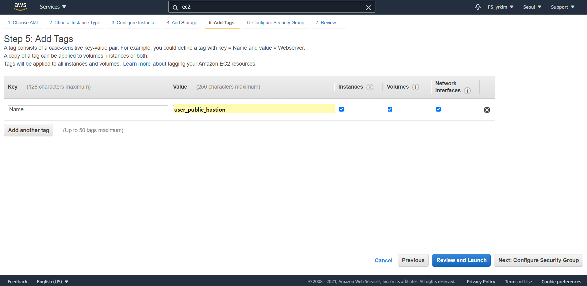

인스턴스의 Tag는 일반적으로 사용자 혹은 시스템에서 용도 별로 구분하기 위해 사용합니다.

**인스턴스의 보안 그룹을 정의 합니다.**


Security Group은 IDC 환경의 방화벽과 유사하게 동작하는 논리 방화벽 입니다.
Security Group은 수 많은 프로토콜을 지원하며 IP와 Port base 로 들어오는 트래픽과 나가는 트래픽에 대해 “명시적인 허용” 만을 설정 할 수 있으며, 예외사항으로 정책의 허용으로 들어온 트래픽에 대해서는 허용 하지 않습니다.

- Type : 트래픽의 서비스를 정의
- Protocol : 허용할 프로토콜로 일반적으로 등록하는 프로토콜은 TCP, UDP, ICMP 등이 있습니다.
- Port Range : TCP 혹은 UDP에 대해 허용할 포트의 범위 지정
- Source : 트래픽에 대한 출발지를 정의, IP 대역이나 Security Group 이 될 수도 있습니다.
  - Security group 은 다음을 포함할 수 있습니다.
    - 현재 보안 그룹
    - 동일한 VPC에 대한 다른 보안 그룹
    - VPC Peering 연결에서 동일한 피어 VPC에 대한 다른 보안 그룹
    - Description : 사용자가 정책을 구분하기 위한 메모

**마지막 인스턴스를 런치하기 전 설정 사항을 확인 합니다.**


AWS 에서는 기본적으로 Key pair 방식으로 인스턴스의 접근을 제어 합니다.
인스턴스에 접속할 수 있는 유일한 수단이므로 키 관리가 중요 하며, 생성된 키를 분실 하셨을 경우 별도의 작업을 하지 않는 이상 인스턴스에 접근이 불가합니다.

> “Key pair name” 의 이름을 정의 -> “Download Key Pair” -> “Launch Instances”

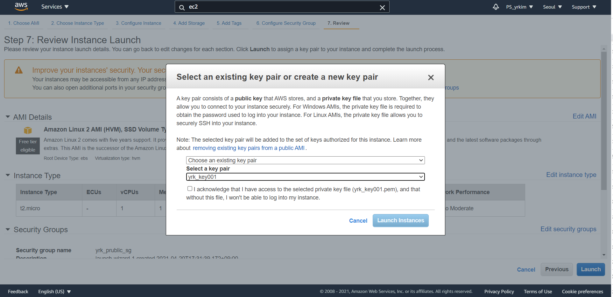

이렇게 설정 키페어까지 선택 한 후 'Launch Instance' 를 클릭 하면 아래와 같은 인스턴스 시작 상태를 확인 할 수 있습니다.


인스턴스를 시작할 때 초기 상태(Instance State)는 pending입니다. 인스턴스가 시작된 후에는 Instance State가 running으로 바뀌고 퍼블릭 DNS를 받습니다.

### 2.2.2 Private Subnet에 인스턴스 생성하기

이번에는 Public Subnet 이 아닌 Private Subnet 에 인스턴스를 생성하도록 하겠습니다. 이전과 동일한 방식으로 진행하면 됩니다

- Instance Type: t3.xlarge
- subnet→ private subnet 선택


## 2.3 Amazon EC2(Elastic Compute Cloud) 접속하기

### 2.3.1 사전작업

생성한 "user_public_bastion” 인스턴스에 접근하기 위하여 Security Group 정책을 수정합니다.

본 실습에서는 특정 포트를 통해서만 접근할 수 있도록 Inbound Rule을 아래 이미지와 같이 수정해줍니다.

> “Network & Security → “Security Groups” → 해당 Security Group 선택 → “Edit inbound rules”

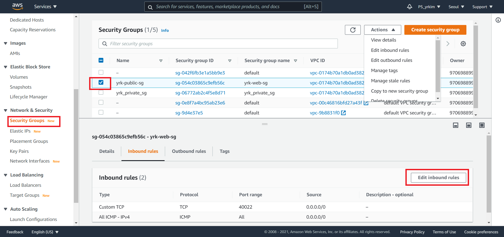


---

### 2.3.2 Amazon EC2(Elastic Compute Cloud)에 접속하기

로컬 컴퓨터의 운영 체제에 따라 로컬 컴퓨터에서 Linux 인스턴스로 연결하는 데 필요한 옵션이 결정됩니다.아래와 같은 다양한 방법이 있지만, 본 실습에서는 PuTTY를 활용하여 Linux 인스턴스에 연결하도록 하겠습니다.

**로컬 컴퓨터 운영 체제가 Linux 또는 macOS X인 경우**
• [SSH 클라이언트](https://docs.aws.amazon.com/ko_kr/AWSEC2/latest/UserGuide/AccessingInstancesLinux.html)
• [EC2 Instance Connect](https://docs.aws.amazon.com/ko_kr/AWSEC2/latest/UserGuide/Connect-using-EC2-Instance-Connect.html)
• [AWS 시스템 관리자 Session Manager](https://docs.aws.amazon.com/systems-manager/latest/userguide/session-manager.html)

**로컬 컴퓨터 운영 체제가 Windows인 경우**
• [PuTTY](https://docs.aws.amazon.com/ko_kr/AWSEC2/latest/UserGuide/putty.html)
• [SSH 클라이언트](https://docs.aws.amazon.com/ko_kr/AWSEC2/latest/UserGuide/AccessingInstancesLinux.html)
• [AWS 시스템 관리자 Session Manager](https://docs.aws.amazon.com/systems-manager/latest/userguide/session-manager.html)
• [Windows Subsystem for Linux](https://docs.aws.amazon.com/ko_kr/AWSEC2/latest/UserGuide/WSL.html)

### 2.3.3 Amazon EC2(Elastic Compute Cloud)에 접속하기 - PuTTY 활용

**Puttygen으로 .PPK 형태의 KEY 생성**

1.  [https://www.chiark.greenend.org.uk/~sgtatham/putty/](https://www.chiark.greenend.org.uk/~sgtatham/putty/) 접속
2.  Puttygen Download Putty Latest version
3.  puttygen.exe 실행
4.  Type of key to generate Type RSA 선택 후 Load 버튼 클릭

    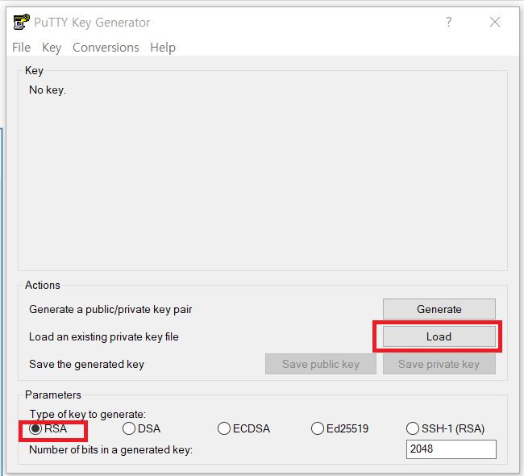

5.  파일 종류 All Files 로 변경 후 인스턴스 생성시 사용했던 .pem 파일 선택 후 열기

    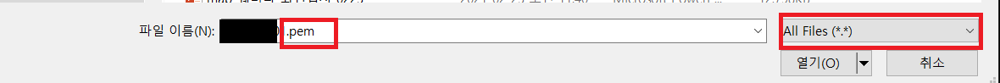

6.  Save private key 선택 후 .ppk 파일로 키 저장

    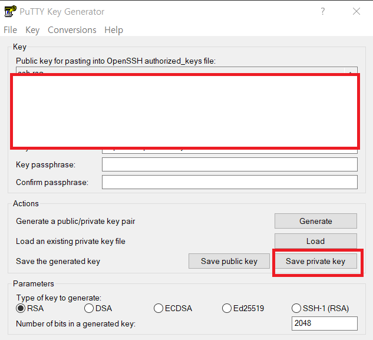

**PuTTY로 인스턴스에 연결**

Instance → 접속 할 인스턴스 클릭 → Action → Connect

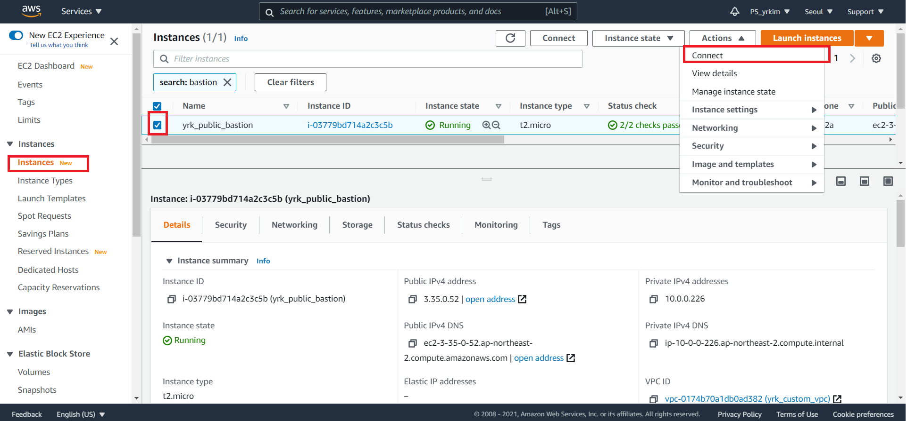

1. Connect to your instance using its Public DNS 주소 복사

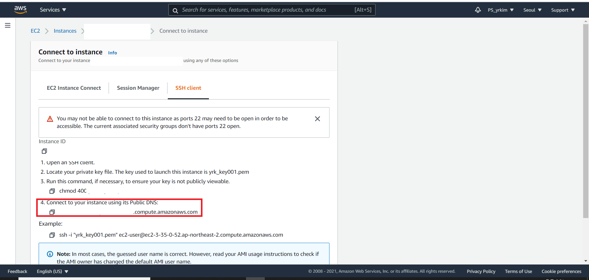

2. PuTTY 실행

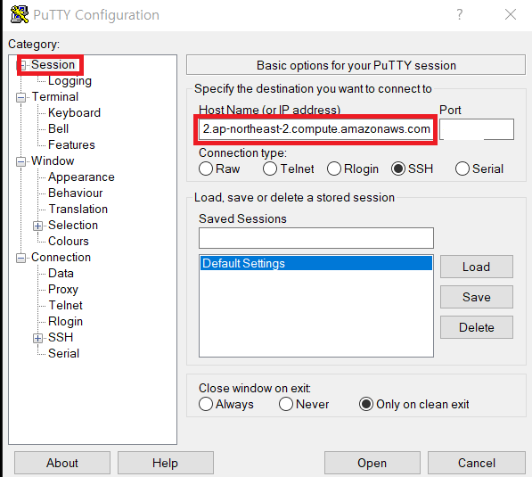

Session → Host Name에 아까 복사한 DNS 주소 입력

Security Group 중 인바운드 규칙 허용해준 포트 번호 입력

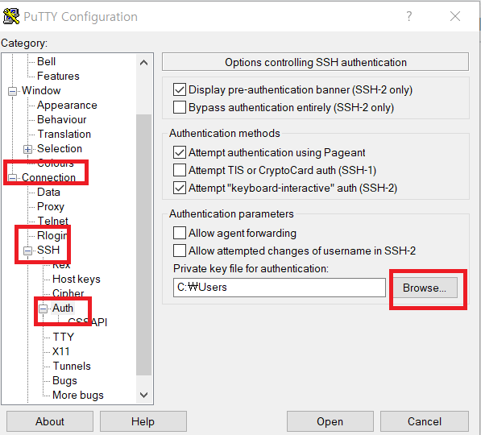

Connection → SSH → Auth 클릭하여 Private key file for authentication 에 아까 .ppk 파일로 변환한 파일 넣기


세팅 완료 후 save 후 터미널 접근

### 2.3.4 Amazon EC2(Elastic Compute Cloud)에 접속하기 - Mac or Linux

**Mac OS X or Linux (OpenSSH)**

기본적으로 Mac OS X 및 Linux 운영 체제는 모두 EC2 Linux 인스턴스에 연결하는데 사용할 수 있는 SSH 클라이언트와 함께 제공 됩니다.

SSH 클라이언트를 작성한 키와 함께 사용하려면 몇 단계가 필요합니다.

1. EC2 인스턴스를 시작하는 동안 다운로드 한 Private Key 를 홈 디렉토리의 .ssh 디렉토리에 넣는 것이 가장 이상적입니다. 이 경우 ssh 접속시 -i 옵션 없이 키 경로만 입력하면 접근 가능하여 조금 더 편리하게 인스턴스에 접속 가능합니다.

```bash
mv user xxxx.pem ~/.ssh
```

2. Public Key의 권한을 변경

```bash
chmod 400 ~/.ssh/xxxx.pem
```

<aside>
💡 참고 : 권한 또는 ssh 관련 이슈발생 시 [이곳](https://docs.aws.amazon.com/ko_kr/AWSEC2/latest/UserGuide/TroubleshootingInstancesConnecting.html#troubleshoot-unprotected-key)을 참고하세요.

</aside>

- 프라이빗 서브넷에 위치한 인스턴스(elastic)에 접근하기 위한 .pem 파일을 bastion으로 전달하는 방법 -scp 사용
- (퍼블릭 DNS) 인스턴스의 대상으로 파일을 전송하려면 컴퓨터에서 다음 명령을 입력합니다.

```bash
scp -P Pot number -i /path/my-key-pair.pem /path/my-file.txt ec2-user@my-instance-public-dns-name:path/
```

- 실제로 적용하면 아래와 같이 키 전달이 가능합니다.

```bash
scp -P 40022 -i yrk_key001.pem yrk_key002.pem ec2-user@ec2-3-35-169-208.ap-northeast-2.compute.amazonaws.com:/home
/ec2-user
yrk_key002.pem                                                                        100% 1700   366.5KB/s   00:00

```

3. 인스턴스에 연결할 때 Private Key 를 사용하십시오. ssh 클라이언트의 형식은
   아래와 같습니다.

```bash
ssh -i */path/my-key-pair*.pem *my-instance-user-name*@*my-instance-public-dns-name*
```

따라서 Amazon Linux 인스턴스에 연결하려면 다음과 같은 명령어가 필요합니다.

```bash
ssh –i xxxx.pem ec2-user@EC2 Host Name or EIP
```

- 대표적인 AMI 들의 일반 유저명은 다음과 같습니다.
  - Amazon Linux 2 또는 Amazon Linux AMI의 경우 사용자 이름은 ec2-user입니다.
  - Centos AMI의 경우 사용자 이름은 centos입니다.
  - Debian AMI의 경우 사용자 이름은 admin 또는 root입니다.
  - Fedora AMI의 경우 사용자 이름은 ec2-user 또는 fedora입니다.
  - RHEL AMI의 경우 사용자 이름은 ec2-user 또는 root입니다.
  - SUSE AMI의 경우 사용자 이름은 ec2-user 또는 root입니다.
  - Ubuntu AMI의 경우 사용자 이름은 ubuntu입니다.

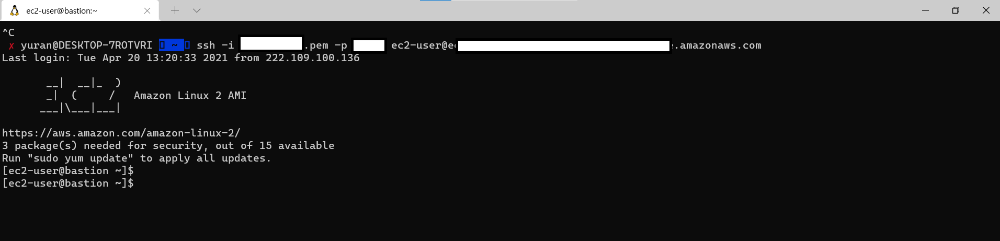

[프라이빗 / 퍼블릭 키 배포관련](assets/images/basichandson/%E1%84%91%E1%85%B3%E1%84%85%E1%85%A1%E1%84%8B%E1%85%B5%E1%84%87%E1%85%B5%E1%86%BA%20%E1%84%91%E1%85%A5%E1%84%87%E1%85%B3%E1%86%AF%E1%84%85%E1%85%B5%E1%86%A8%20%E1%84%8F%E1%85%B5%20%E1%84%87%E1%85%A2%E1%84%91%E1%85%A9%E1%84%80%E1%85%AA%E1%86%AB%E1%84%85%E1%85%A7%E1%86%AB%20b7960d3422c840dcb6712007ca16b570.md)

## 2.4 Amazon EC2(Elastic Compute Cloud) 접속하여 계정 설정하기

### 2.4.1 **퍼블릭 서브넷에 위치한 인스턴스 설정**

<aside>
💡 설정 해야 할 사항 
1. 퍼블릭키 접근 시 key가 아닌 password로 접근 가능하도록 설정 변경
2. 포트 번호 변경
3. 계정 생성 및  password 설정
4. 프라이빗 서브넷에 위치한 인스턴스에 접근할 수 있도록 키 값 설정

</aside>

---

- 리눅스 기본

  **사용자 리스트 및 정보 보기**
  `cat /etc/passwd` 사용자
  `cat /etc/group` 그룹
  `cat /etc/login.def` 패스워드 유효기간, 디렉토리 자동 생성 등

  [Copy of 명령어](assets/images/basichandson/Copy%20of%20%E1%84%86%E1%85%A7%E1%86%BC%E1%84%85%E1%85%A7%E1%86%BC%E1%84%8B%E1%85%A5%20c6b516f1989e4de68a10256eb1434320.md)

  **사용자 및 그룹 관리 파일**

  - /etc/skel : 사용자에 대한 기본적인 초기화 파일들이 저장되어 있음.
  - /etc/login.defs : 사용자나 그룹을 생성할 때 참고하는 기본 값들이 저장되어 있음.

  [Copy of 사용자 전환](assets/images/basichandson/Copy%20of%20%E1%84%89%E1%85%A1%E1%84%8B%E1%85%AD%E1%86%BC%E1%84%8C%E1%85%A1%20%E1%84%8C%E1%85%A5%E1%86%AB%E1%84%92%E1%85%AA%E1%86%AB%203fedac0d638c46ecac5af6715d64ce9e.md)

0. hostname 변경(해도되고 안해도 됨)

```bash
hostnamectl set-hostname bastion
exec bash
#변경 사항 바로 적용
```

1. 퍼블릭 서브넷에 위치한 인스턴스 접근 시 key가 아닌 password로 접근 가능하도록 설정 변경

```bash
sudo vim /etc/ssh/sshd_config

```

로그인 방법 변경

- **61번째**에 있는 `PasswordAuthentication` 부분 주석을 해제하고 yes로 변경

```bash
...

# To disable tunneled clear text passwords, change to no here!
PasswordAuthentication yes
#PermitEmptyPasswords no

...
```

2. 포트 번호 변경

```bash
sudo vim /etc/ssh/sshd_config
```

Port 변경

- **17번째**에 있는 `Port` 부분의 주석을 해제하고 원하는 Port 번호로 변경

```bash
#       $OpenBSD: sshd_config,v 1.100 2016/08/15 12:32:04 naddy Exp $

# This is the sshd server system-wide configuration file.  See
# sshd_config(5) for more information.

# This sshd was compiled with PATH=/usr/local/bin:/usr/bin

# The strategy used for options in the default sshd_config shipped with
# OpenSSH is to specify options with their default value where
# possible, but leave them commented.  Uncommented options override the
# default value.

# If you want to change the port on a SELinux system, you have to tell
# SELinux about this change.
# semanage port -a -t ssh_port_t -p tcp #PORTNUMBER
#
Port '바꿀 번호'
#AddressFamily any
#ListenAddress 0.0.0.0
#ListenAddress ::

...
```

```bash
systemctl restart sshd
```

<aside>
💡 참고 : 열려있는 포트 확인방법

</aside>

- `netstat` 을 활용한 포트확인

```bash
[ec2-user@bastion ~]$ netstat -nltp
(No info could be read for "-p": geteuid()=1000 but you should be root.)
Active Internet connections (only servers)
Proto Recv-Q Send-Q Local Address           Foreign Address         State       PID/Program name
tcp        0      0 127.0.0.1:25            0.0.0.0:*               LISTEN      -
tcp        0      0 0.0.0.0:111             0.0.0.0:*               LISTEN      -
tcp        0      0 0.0.0.0:40022           0.0.0.0:*               LISTEN      -
tcp6       0      0 :::111                  :::*                    LISTEN      -
tcp6       0      0 :::40022                :::*                    LISTEN      -
```

- `systemctl status` 명령을 활용한 서비스 포트확인

```bash
[ec2-user@bastion ~]$ systemctl status sshd
● sshd.service - OpenSSH server daemon
   Loaded: loaded (/usr/lib/systemd/system/sshd.service; enabled; vendor preset: enabled)
   Active: active (running) since Mon 2021-04-26 11:28:58 UTC; 23min ago
     Docs: man:sshd(8)
           man:sshd_config(5)
 Main PID: 3155 (sshd)
   CGroup: /system.slice/sshd.service
           └─3155 /usr/sbin/sshd -D

Apr 26 11:28:58 bastion systemd[1]: Starting OpenSSH server daemon...
Apr 26 11:28:58 bastion sshd[3155]: Server listening on 0.0.0.0 port 40022.
Apr 26 11:28:58 bastion sshd[3155]: Server listening on :: port 40022.

...
```

- 프라이빗 서브넷에 위치한 인스턴스 관리를 위한 계정 생성

3-1. 계정 생성

```bash
tail /etc/passwd
# tail~ 로 현재 어떠한 사용자가 있는지 확인
sudo useradd 'USER'
```

3-2. 계정 비밀 번호 생성

```bash
sudo passwd 'USER'
# Changing password for user 'USER'
# New password: 비밀번호 입력
```

4. private subnet에 위치한 인스턴스에 접근할 수 있도록 private instance에 접근하기 위한 .pem 파일을 USER에게 복사

- `$HOME/`

```bash
[ec2-user@bastion ~]$ sudo mv yrk_key001.pem /home/yrk002/
```

---

### 2.4.2 프라이빗 **서브넷에 위치한 인스턴스 설정**

- 참고
  - 비밀번호 변경
  ```bash
  scp -P 40022 -i yrk_key001.pem yrk_key002.pem ec2-user@ec2-3-35-169-208.ap-northeast-2.compute.amazonaws.com:/home
  /'USER'
  yrk_key002.pem                                                                        100% 1700   366.5KB/s   00:00

  ```
  - 만약에 파일 소유 그룹이 ec2-user로 되어 있다면 아래 명령어로 그룹 변경
  ```bash
  sudo chown USER:USER yrk_key002.pem
  ```

1. bastion인스턴스에서 프라이빗 서브넷에 위치한 인스턴스에 접속 하는 방법

```bash
ssh -i xxxx.pem ec2-user@ 프라이빗 서브넷에 위치한 인스턴스의Private IPv4 addresses

```

-

```bash
[cje001@basiton /]$ ssh -i /home/USER/.ssh/yrk_key002.pem ec2-user@ip-10-0-1-152.ap-northeast-2.compute.internal

       __|  __|_  )
       _|  (     /   Amazon Linux 2 AMI
      ___|\___|___|

https://aws.amazon.com/amazon-linux-2/
```

- 프라이빗 인스턴스에 접근 후 계정 생성 및 패스워드 생성

```bash
sudo useradd elastic
sudo passwd elastic

```

- 새로 생성한 elastic 계정에 sudo 권한을 주고 싶다면? 권한변경 (sudo)

```bash
[root@elastic ~]# visudo -f /etc/sudoers

```

**elastic ALL=(ALL) ALL 추가**

```bash
Defaults    env_keep += "LC_COLLATE LC_IDENTIFICATION LC_MEASUREMENT LC_MESSAGES"
Defaults    env_keep += "LC_MONETARY LC_NAME LC_NUMERIC LC_PAPER LC_TELEPHONE"
Defaults    env_keep += "LC_TIME LC_ALL LANGUAGE LINGUAS _XKB_CHARSET XAUTHORITY"

#
# Adding HOME to env_keep may enable a user to run unrestricted
# commands via sudo.
#
# Defaults   env_keep += "HOME"

Defaults    secure_path = /sbin:/bin:/usr/sbin:/usr/bin

## Next comes the main part: which users can run what software on
## which machines (the sudoers file can be shared between multiple
## systems).
## Syntax:
##
##      user    MACHINE=COMMANDS
##
## The COMMANDS section may have other options added to it.
##
## Allow root to run any commands anywhere
root    ALL=(ALL)       ALL
**elastic    ALL=(ALL)       ALL**

## Allows members of the 'sys' group to run networking, software,
## service management apps and more.
# %sys ALL = NETWORKING, SOFTWARE, SERVICES, STORAGE, DELEGATING, PROCESSES, LOCATE, DRIVERS

## Allows people in group wheel to run all commands
```

- 포트 변경

```bash
vim /etc/ssh/sshd_config
```

```bash

#       $OpenBSD: sshd_config,v 1.100 2016/08/15 12:32:04 naddy Exp $

# This is the sshd server system-wide configuration file.  See
# sshd_config(5) for more information.

# This sshd was compiled with PATH=/usr/local/bin:/usr/bin

# The strategy used for options in the default sshd_config shipped with
# OpenSSH is to specify options with their default value where
# possible, but leave them commented.  Uncommented options override the
# default value.

# If you want to change the port on a SELinux system, you have to tell
# SELinux about this change.
# semanage port -a -t ssh_port_t -p tcp #PORTNUMBER
#
Port 40022
#AddressFamily any
#ListenAddress 0.0.0.0
#ListenAddress ::

HostKey /etc/ssh/ssh_host_rsa_key
#HostKey /etc/ssh/ssh_host_dsa_key
HostKey /etc/ssh/ssh_host_ecdsa_key
HostKey /etc/ssh/ssh_host_ed25519_key

# Ciphers and keying
#RekeyLimit default none

# Logging
#SyslogFacility AUTH
SyslogFacility AUTHPRIV
#LogLevel INFO

# Authentication:

#LoginGraceTime 2m
#PermitRootLogin yes
#StrictModes yes
```

- 서비스 재시작

```bash
systemctl restart sshd
```

- 포트 확인

```bash
netstat -nltp
```
